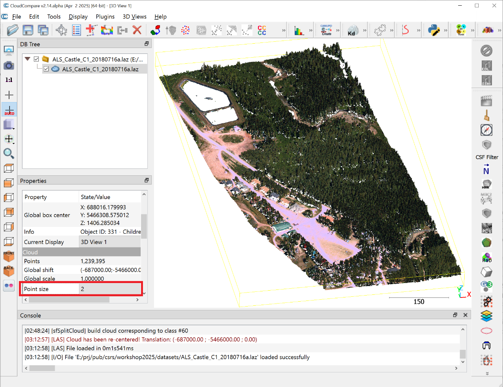
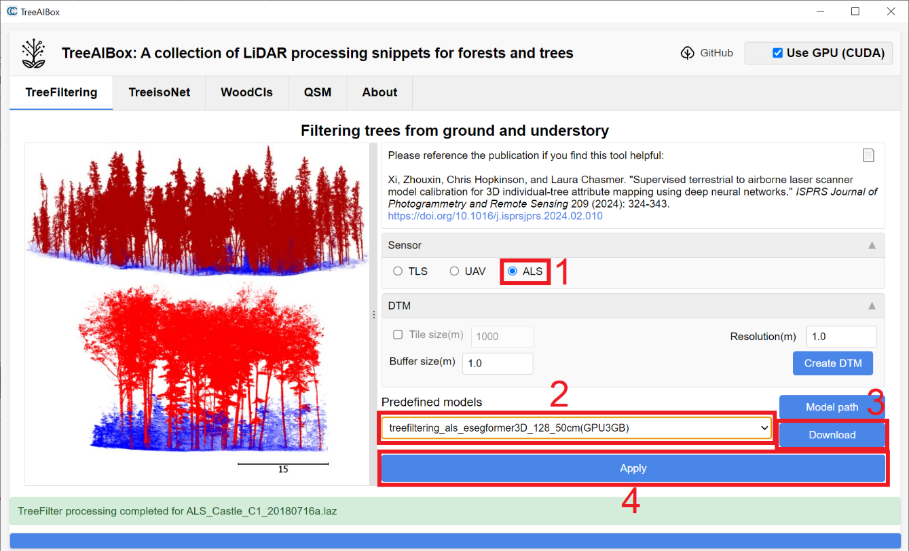
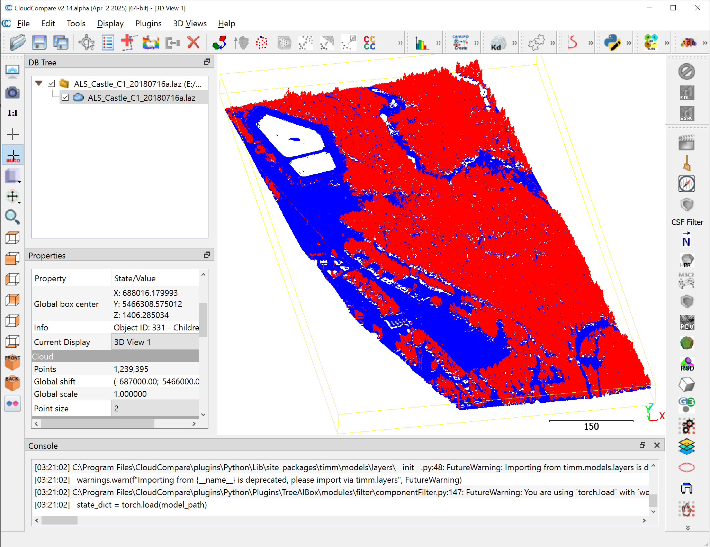
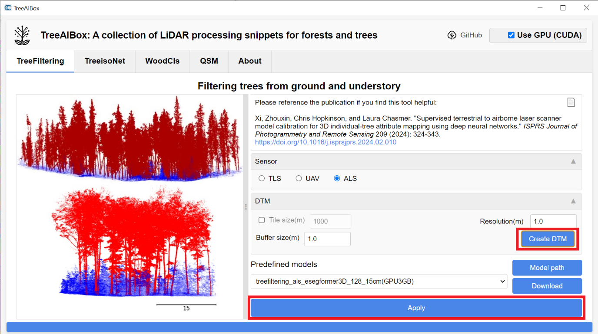
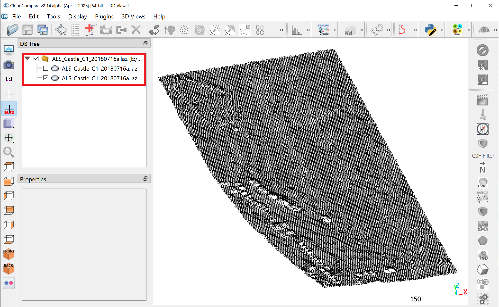
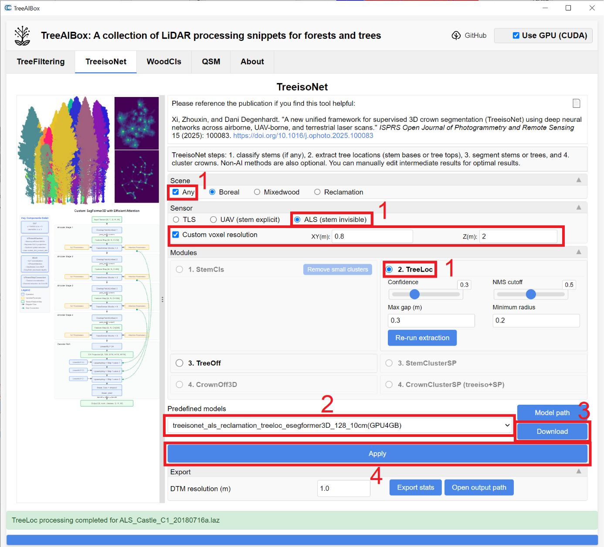
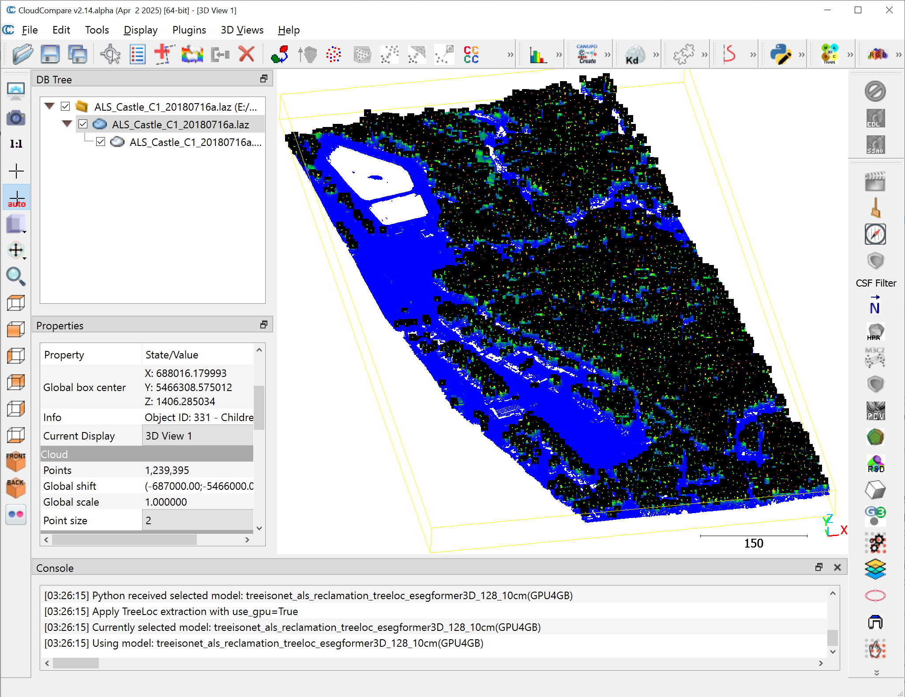
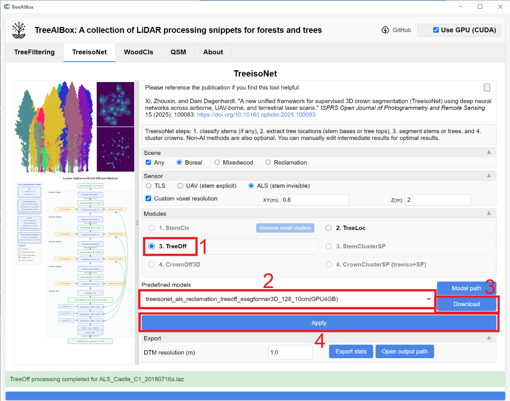
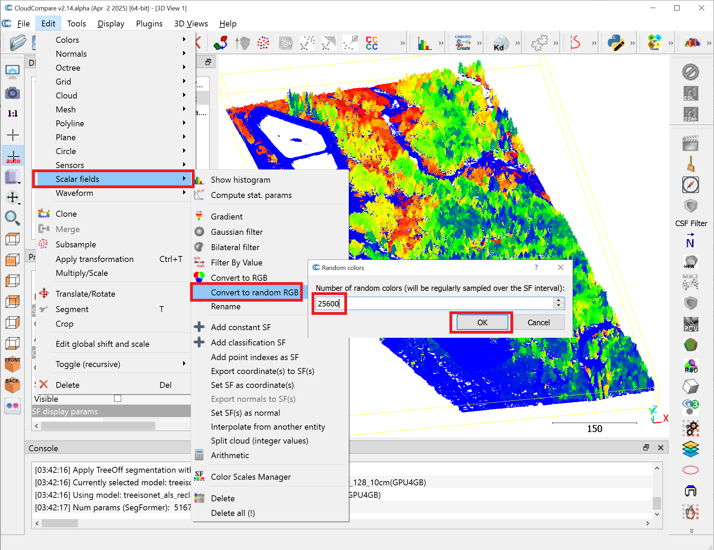
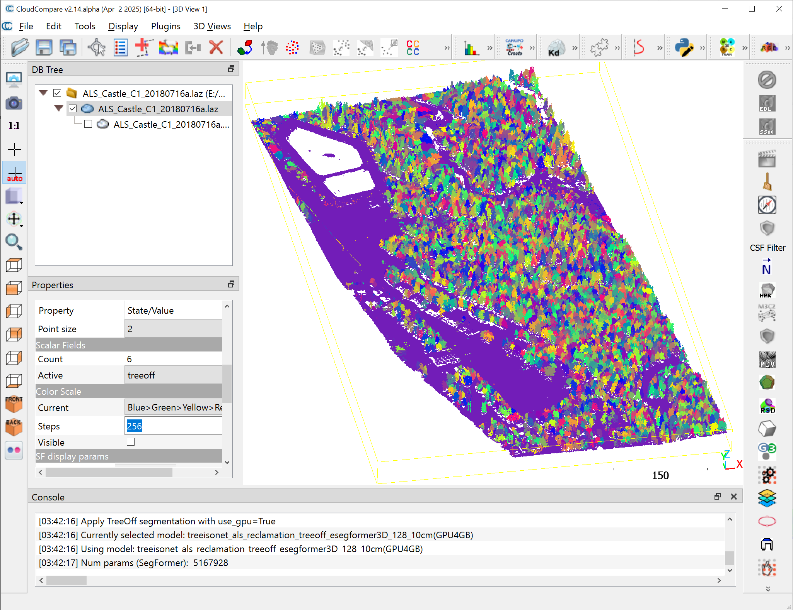

# 3. ALS LiDAR

Site: ALS sample area located in the Eastern Slopes of the Canadian Rockies near Castle Mountain Resort (McCaffrey and Hopkinson, 2020)

Data: ALS_Castle_C1_20180716a.laz

Sensor: Teledyne Optech Titan ALS (<100 pts/m²)

TreeFiltering

Remove previous clouds; load .laz; Apply, Yes.

Select the point cloud. In Properties, set Point size to 2 for clarity.

Choose treefiltering_als_esegformer3D_128_50cm (GPU3GB) → Download, Apply.

- (Optional) Create DTM: set Resolution (m) (voxel resolution) and Buffer size (m) (overlap between moving windows).

Then drag the newly created DEM item up to its parent level in the DB Tree, uncheck the original raw point-cloud layer, and display only the DEM point cloud.

TreeisoNet-TreeLoc (treetop detection)

- Note: We did not train a specific ALS model yet for large-area processing. However, it is possible to reuse a model trained on other sensors for ALS data. Here is an example of how to transfer models across sensors and resolutions

Enable Any and ALS (stem invisible); check Custom voxel resolution → XY(m)=0.8, Z(m)=2.0; choose treeisonet_als_reclamation_treeloc_esegformer3D_128_10cm(GPU4GB)→Download, Apply.

Results: Treetops appear (black), with perpoint confidence shown by color gradient.

TreeisoNet-TreeOff (individual‑tree delineation)

Select the original point cloud (not treetops). Choose 3. TreeOff.

treeisonet_als_reclamation_treeoff_esegformer3D_128_10cm(GPU4GB)→Download,Apply.

Uncheck the tree tops. For clearer visualization, convert treeoff scalar field to random RGB: Edit → Scalar fields → Convert to random RGB. Then input a large number (e.g., 25600). This step randomizes the tree colors. Be careful: it will also remove the default RGB color of the original point cloud.

The trees and ground are now in random colors for clearer visuals.

Click Export stats. Click Open output path to see the newly created csv file on tree locations, heights, and crown areas.

