# 5. QSM / Architecture

Site: Tropical trees scan datasets provided by Guyana Forestry Commission (Gonzalez de Tanago et al. 2018 and Lau et al. 2019)

Remove previous clouds; load GUY02_000.laz; Apply, Yes.

Select the point cloud. In Properties, set Point size to 3 for clarity.

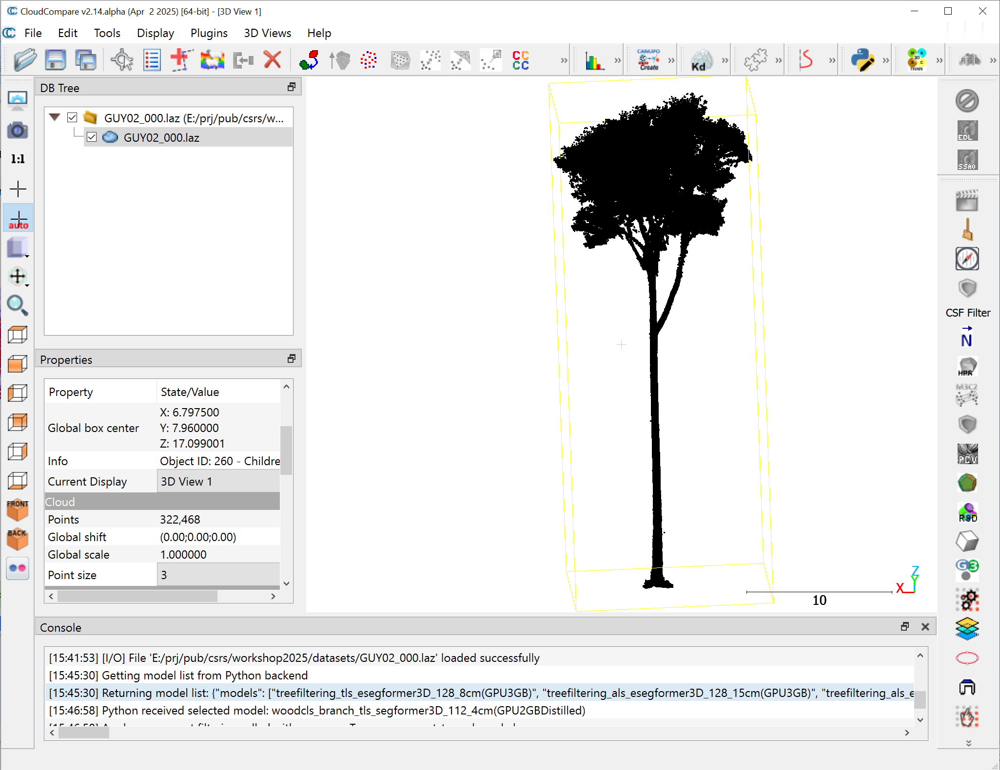

Select cloud; Branch→woodcls_branch_tls_segformer3D_128_2.5cm(GPU3GB)→Download, Apply.

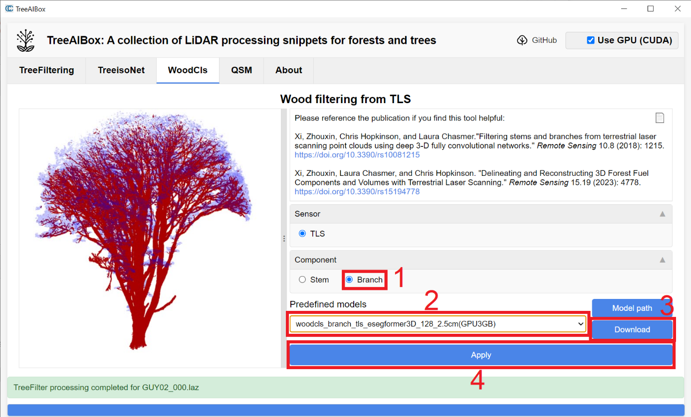

Results: wood points in red and other leafy points in blue in a new scalar field branchcls.

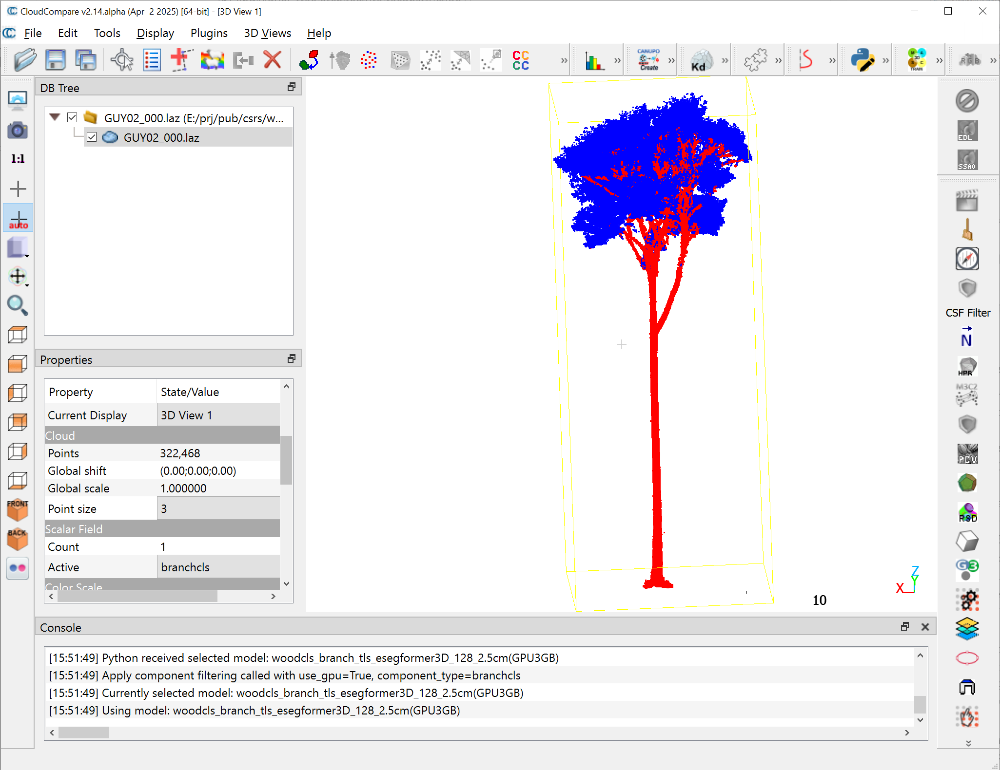

Select cloud; Stem→woodcls_stem_tls_segformer3D_128_4cm(GPU3GB)→Download, Apply.

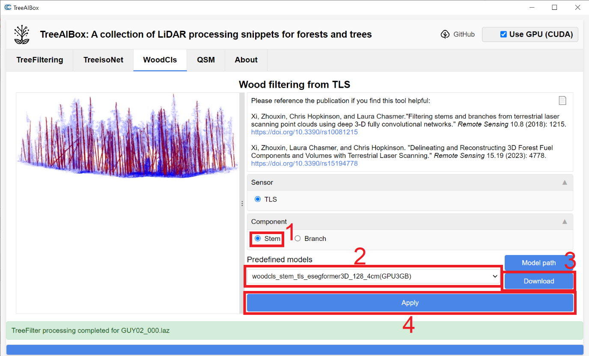

Results: stem points in red and other points in blue in a new scalar field stemcls.

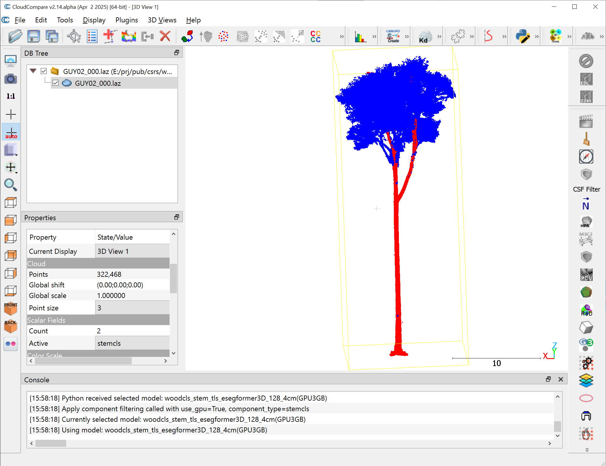

- (Optional) Refine stem label via Filter points , Segment , Merge , and Arithmetic .

Switch to the QSM tab. Customize the parameters in the Initial segmentation: cut-pursuit panel, and click Initial segmentation button. A new scalar field init_segs is then created.

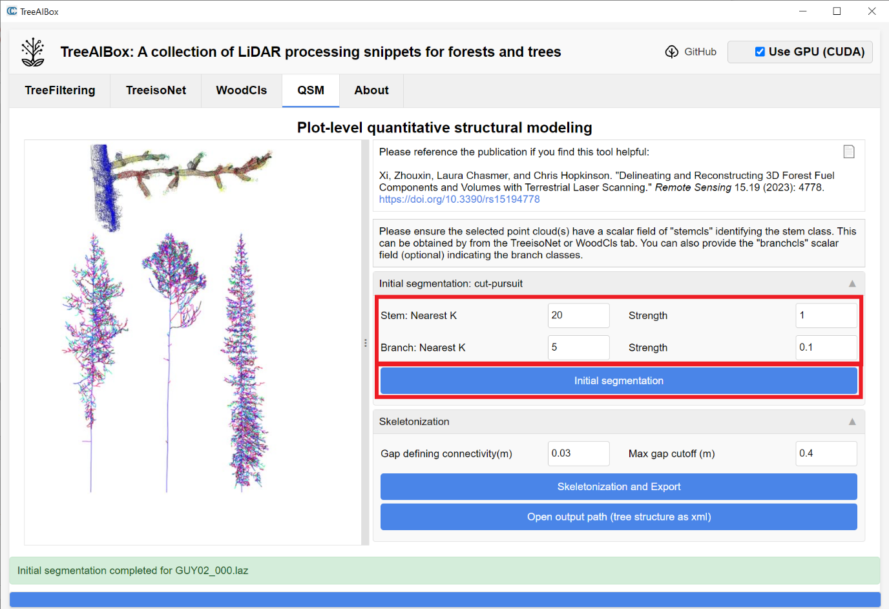

For clearer visualization, convert init_segs scalar field to random RGB: Edit → Scalar fields → Convert to random RGB.

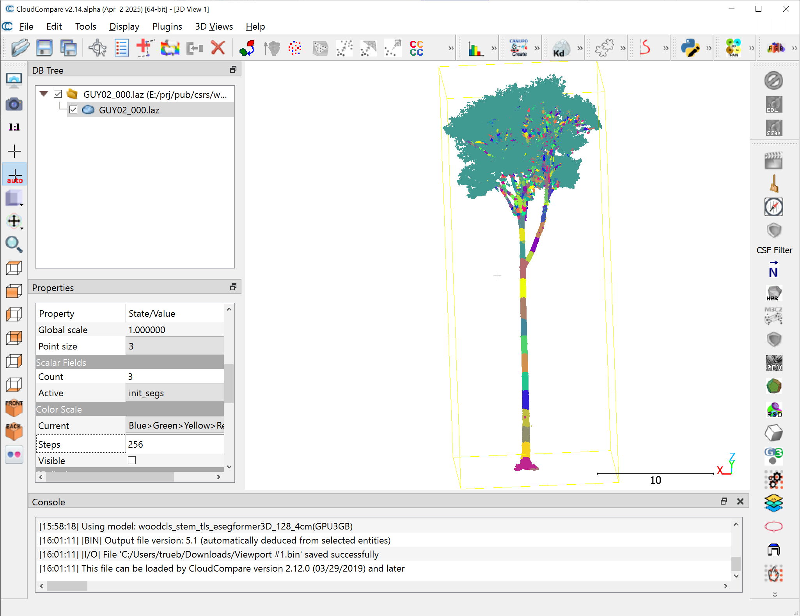

Customize the parameters in the Skeletonization panel, and click Skeletonization and Export.

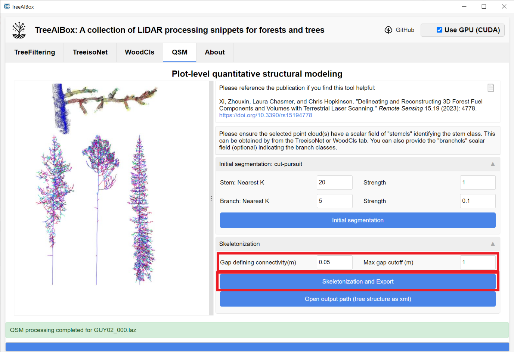

Results: tree skeleton curves and meshes

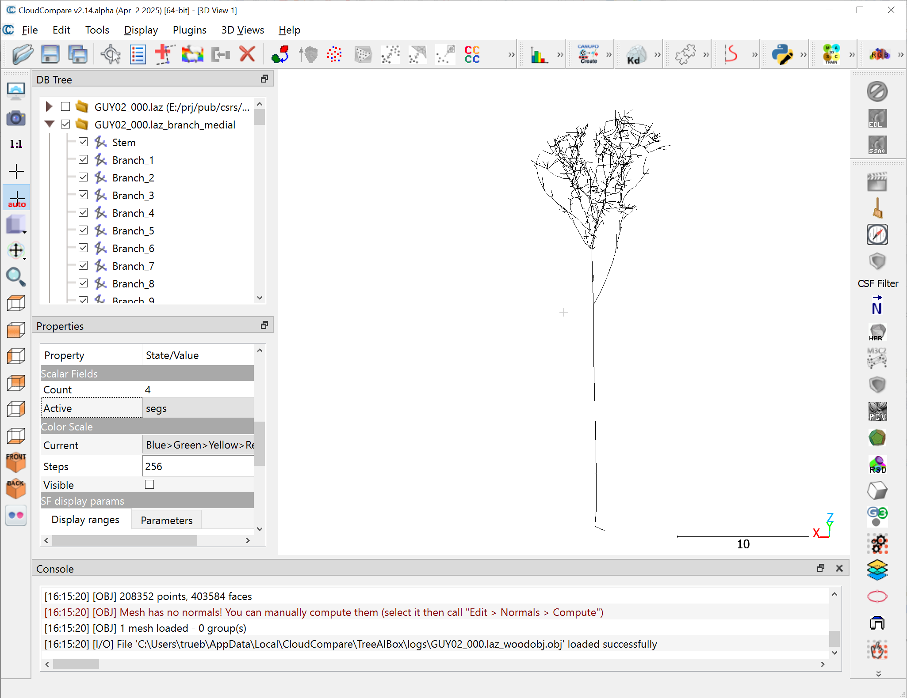

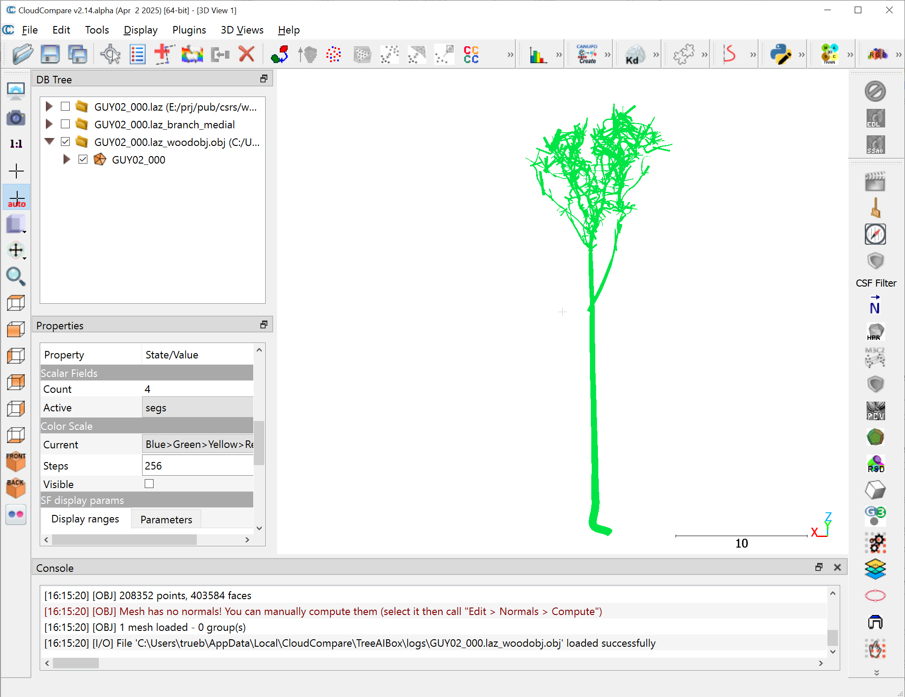

Click Open output path (tree structure as xml). Two files are created: GUY02_000.laz_wood.xml and GUY02_000.laz_woodobj.obj. The first records tree architecture; the latter provides 3D mesh objects for other software.

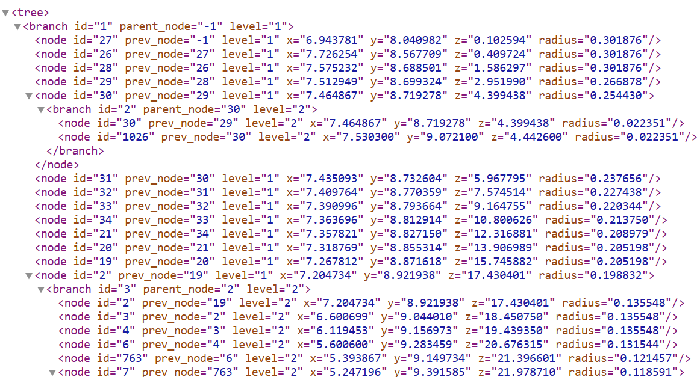
