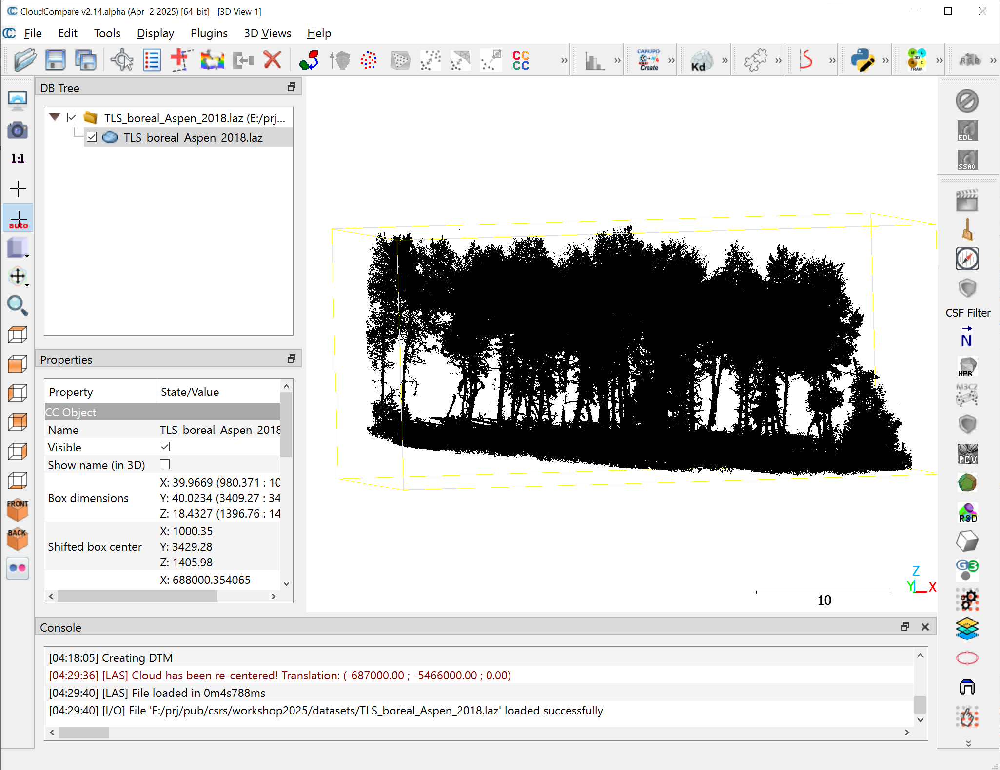
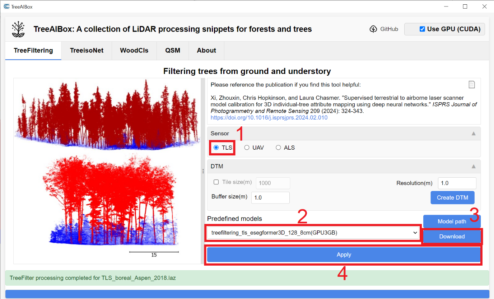
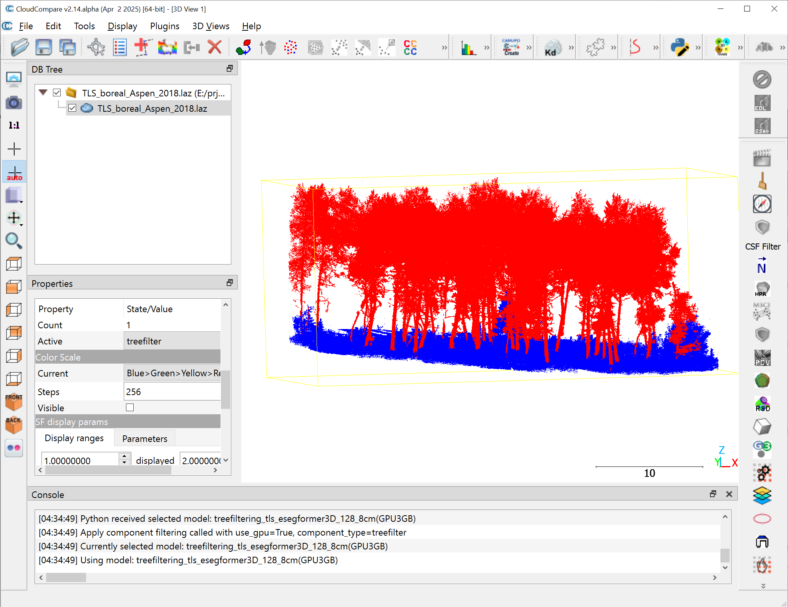
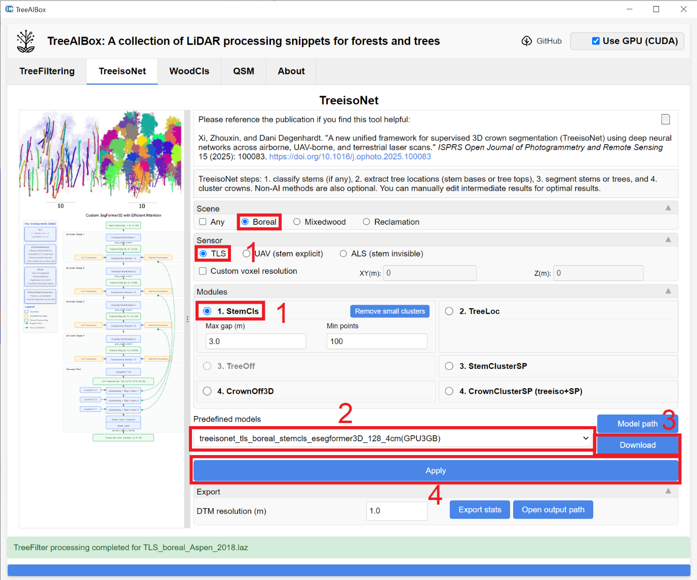
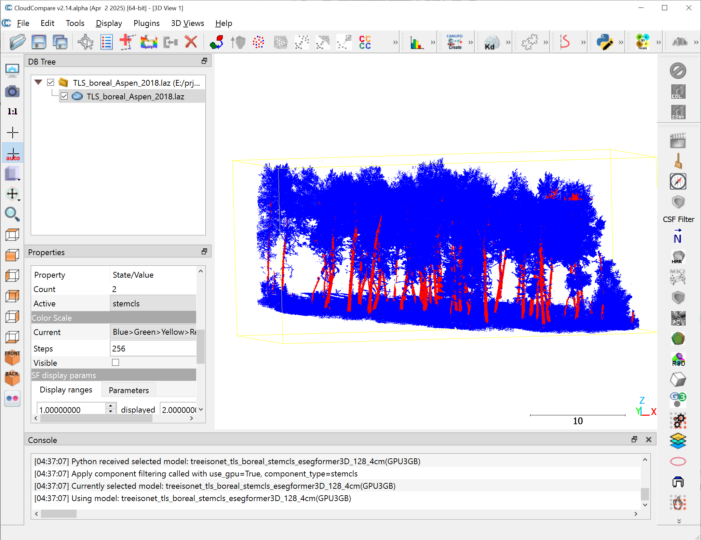
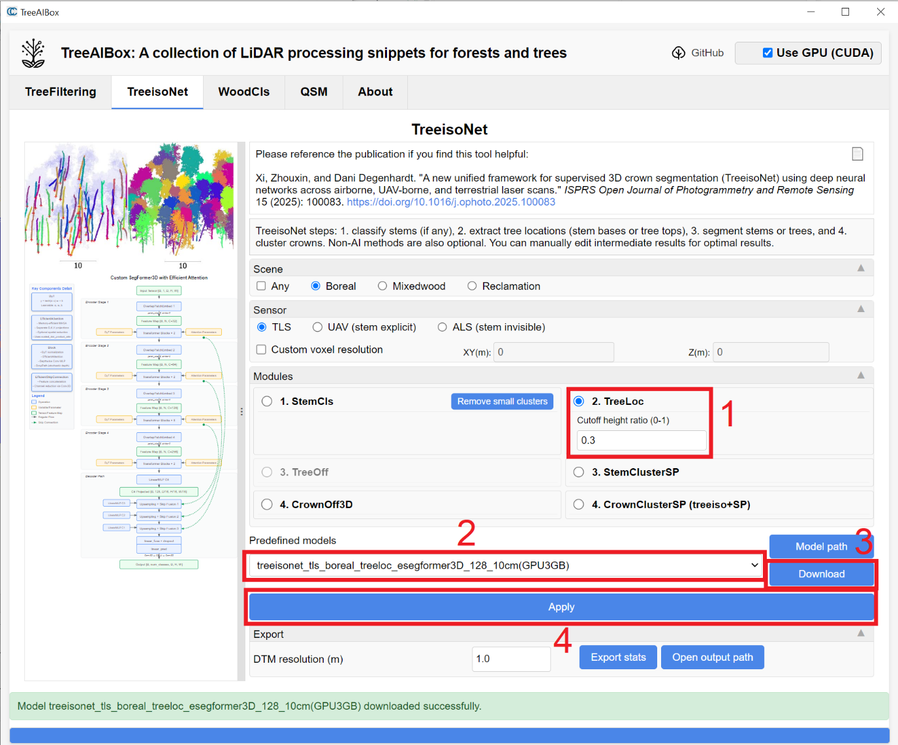
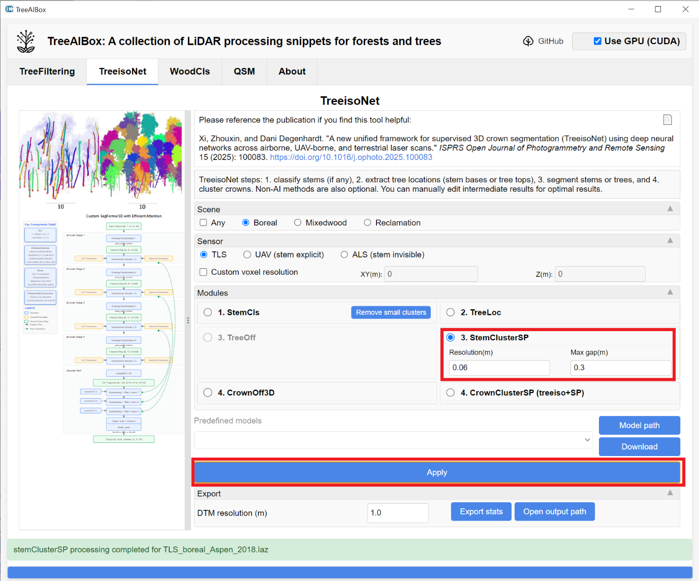
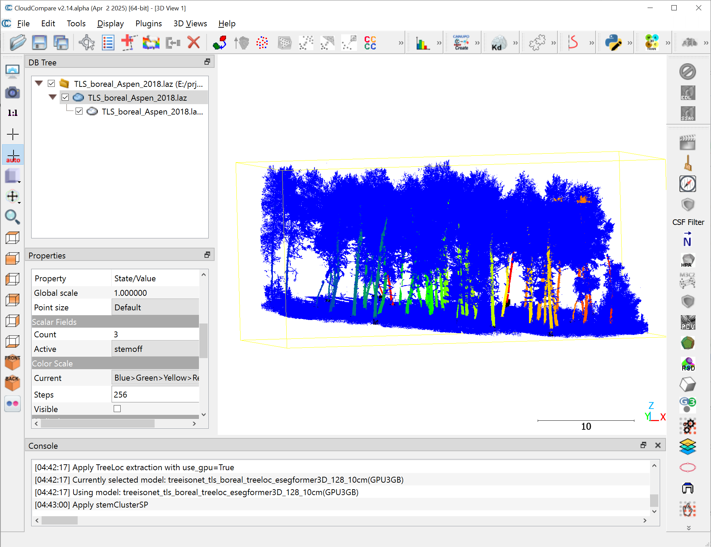
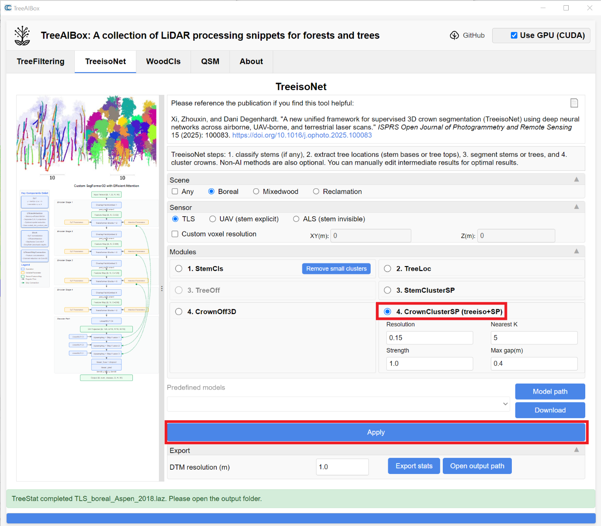
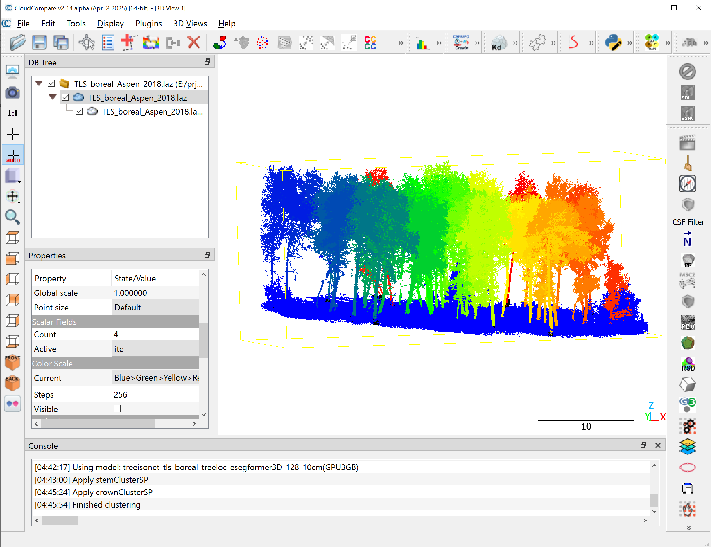

# 4. TLS LiDAR

Site: Aspen trees located in the Eastern Slopes of the Canadian Rockies near Castle Mountain Resort (McCaffrey and Hopkinson, 2020)

Data: TLS_boreal_Aspen_2018.laz

Sensor: Teledyne Optech TLS (~3 400 pts/m²)

Load TLS_boreal_Aspen_2018.laz. Follows same steps as Section 4.2.2, using TLS-specific models.

TreeFiltering: treefiltering_tls_esegformer3D_128_8cm(GPU3GB).

TreeisoNet-StemCls: treeisonet_tls_boreal_stemcls_esegformer3D_128_4cm(GPU3GB).

TreeisoNet-TreeLoc: treeisonet_tls_boreal_treeloc_esegformer3D_128_10cm(GPU3GB).

StemClusterSP: individual-tree stem clustering and isolation based on the shortest-path rule.

Individual-tree delineation via CrownClusterSP or CrownOff3D: treeisonet_tls_boreal_crownoff_esegformer3D_128_15cm(GPU4GB).

